# Projeto Mininet

## Criar a Topologia com Mininet

1. O comando a seguir cria uma topologia do tipo árvore (tree) com:

- Profundidade de 4 níveis (depth=4)
- Dois ramos por nível (fanout=2)
- Largura de banda de 25 Mbps para os links
- Endereços MAC padronizados para cada nó
- Controlador padrão do Mininet

```sh
    sudo mn --topo tree,depth=4,fanout=2 --mac --link=tc,bw=25
```

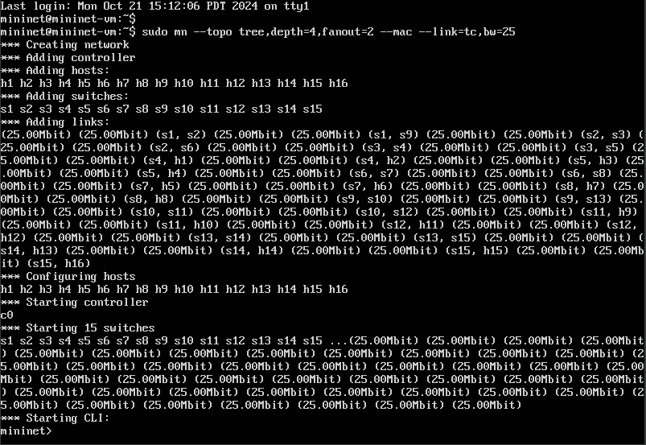

## Inspeção das interfaces, endereços MAC, IP e portas

2. informações das interfaces de rede, endereços MAC, IP e tabela ARP para ver a correspondência de endereços IP e MAC.

```sh
    h1 ifconfig
```

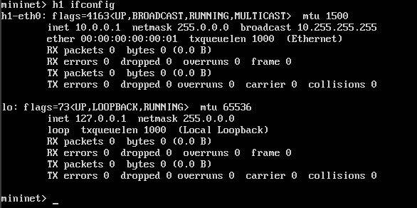

```sh
    h2 ifconfig
```

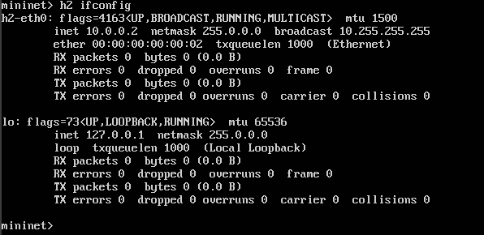

```sh
    nodes
```

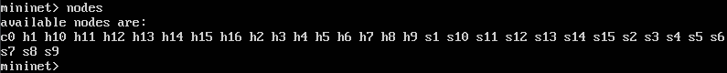

```sh
    net
```

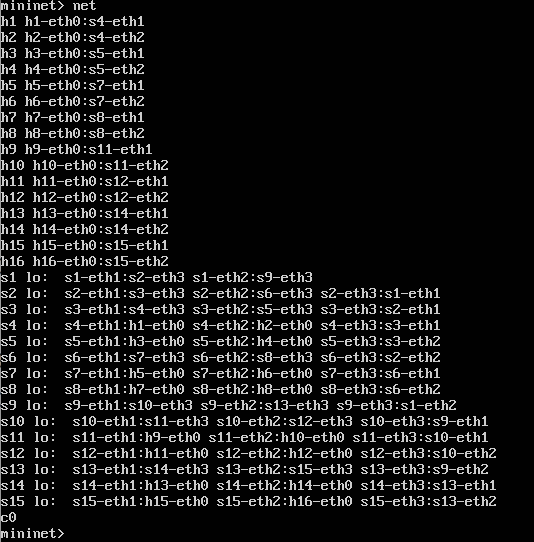

```sh
    dump
```

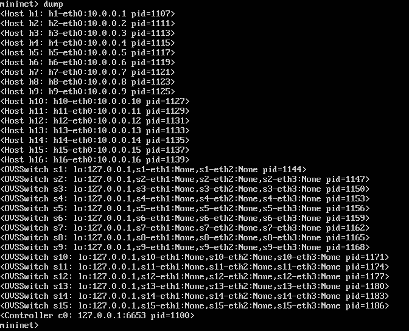

```sh
    h1 arp -n
```

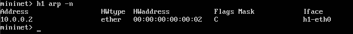

```sh
    h2 arp -n
```

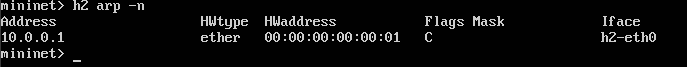

## Testar Conectividade com Ping

3. testando a conectividade entre Host 1 e Host 2 e entre todos os nós da topologia.

```sh
    h1 ping h2
```

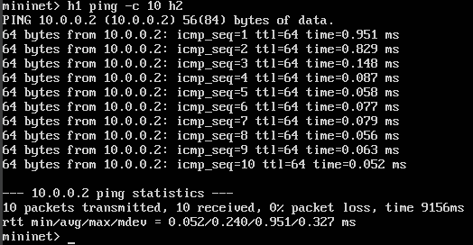

```sh
    pingall
```

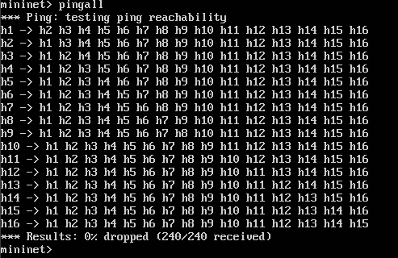

## Configuração do servidor e cliente TCP com iperf

```sh
    h1 iperf -s -p 5555
```

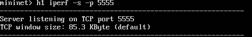

```sh
    h2 iperf -c h1 -p 5555 -i 1 -t 10 -b 25M
```


